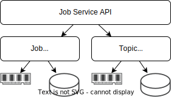

# jobq

jobq is a simple golang library to handle jobs/tasks/things asynchronously without external dependencies.
You can build your own level of service by using volatil (memory) or durable (persistent) backend for storing jobs and topics.

## Features

- Jobs are enqueued in weighted (priority) queue named topic. Lower is the weight, higher is the priority.
- Job can be delayed before enqueued in topic.
- Job and Topic relies on repository adapters so you can build our service level.
- Topic creation is on the fly. Just enqueue on it.
- Simple topic stats when stats collector is enabled.
- Job FSM is simple, only few status: Ready, Delayed, Reserved, Done or Canceled.
- Job API is simple, only few usual methods: Done(), Retry(), Cancel(), Payload(), Logf()
- Job retry defaults to user-configurable exponential backoff.

## Design



## Examples

See complete examples in `examples` directory.

Create a Job service:

```go
import "github.com/colbee1/jobq/service/jqs"

// ...

svc := jqs.New(jobRepo, topicRepo)
```

Producer:

```go
import "github.com/colbee1/jobq"

// Enqueue a job.
//
tp, pri := jobq.Topic("invoices"), 0
jid, _ := svc.Enqueue(context.Background(), tp, pri, jobq.DefaultJobOptions, jobq.Payload(`{ "user_id": "sb1471", "email": "email@domain.tld", "invoice_id": "987654" }`))
```

Consumer:

```go
import "github.com/colbee1/jobq/service"

// Wait at most 5 seconds to get up to 10 jobs from topic at a time.
//
topic := jobq.Topic("invoices")
for {
    ctx, ctxCancel := context.WithTimeout(context.Background(), 5*time.Second)

    jobs, _ = svc.Reserve(ctx, Topic, 10)

    ctxCancel()
    if len(jobs) > 0 {
        go handleJobs(jobs)
    }
}

// ...

func handleJobs(jobs []service.IJob) {
    for _, job := range jobs {
        data, _ := job.Payload()

        // Do some stuff

        if ok {
            job.Done()
        } else {
            job.Retry(time.Time{})
            // Or job.Cancel()
        }
    }
}
```

## Status

### In progress

- Reservation timeout.

### Planned

- Auto cleanup unused topics.
- Auto restart job after application crash when using a durable jobs repository but a volatil one for topics.

### Available job repositories

- repo/job/memory - volatile in-memory storage. Does not support transaction.
- repo/job/badger3 - durable file system storage. Support transactions.

### Available topic repositories

- repo/pq/memory - volatile in-memory fast priority queues. Does not support transaction.
- repo/pq/badger3 - durable file system storage. Support transactions.
